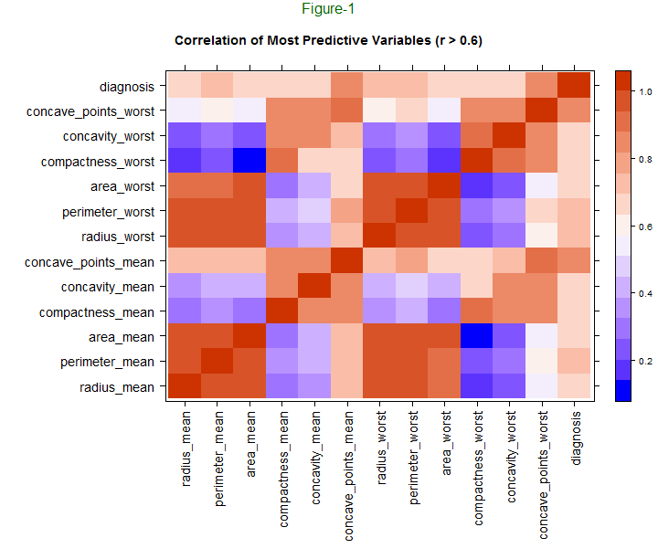
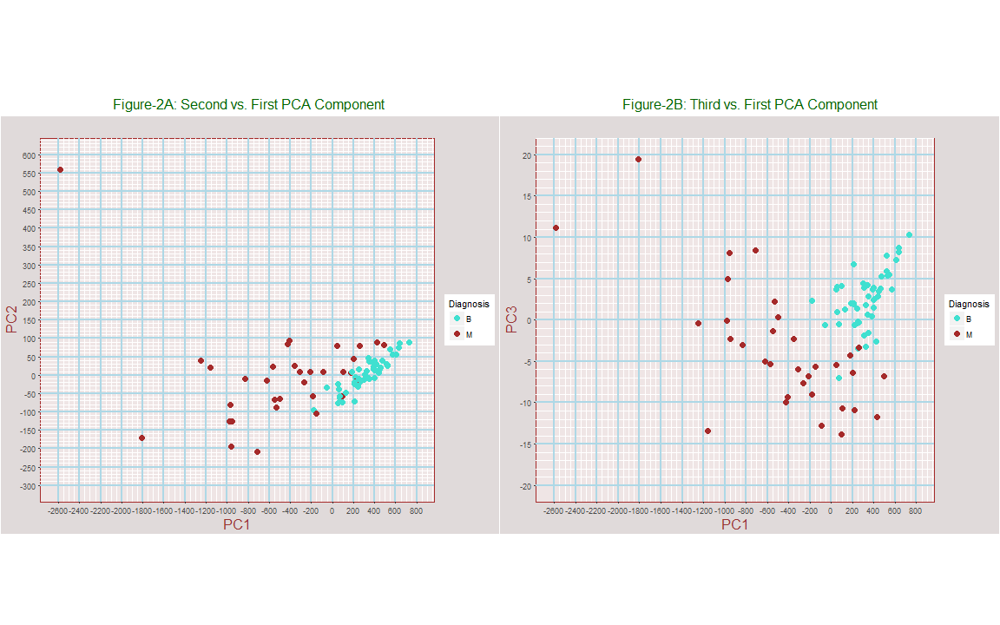
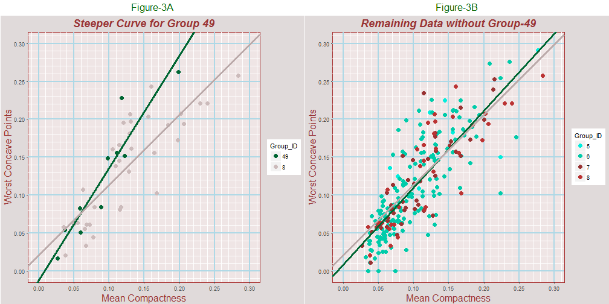
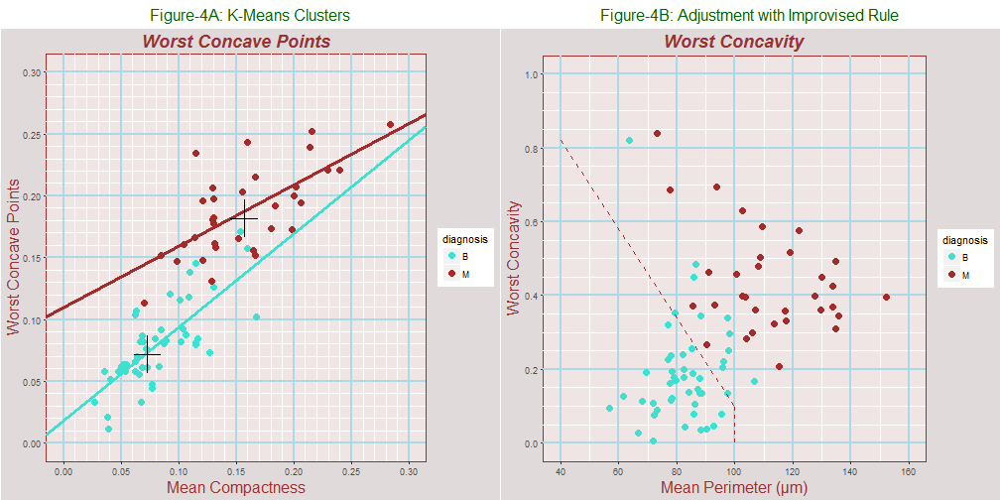
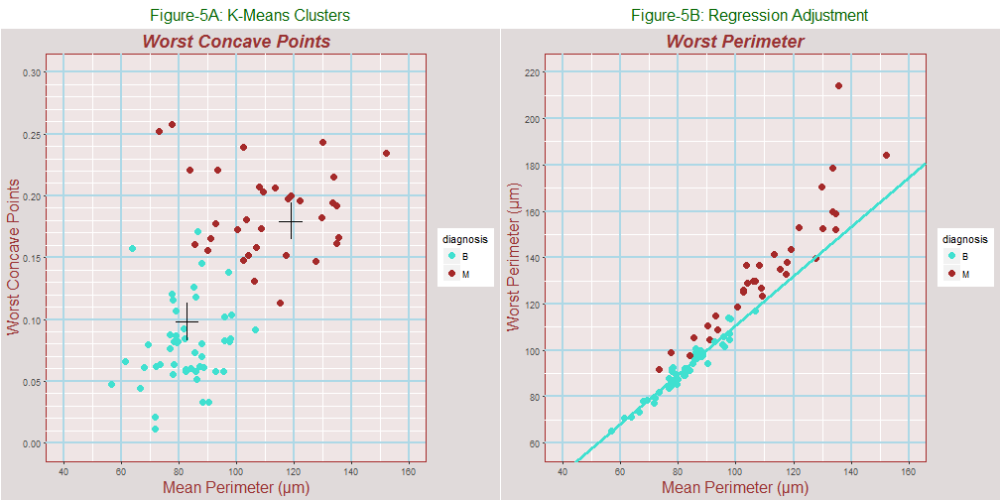
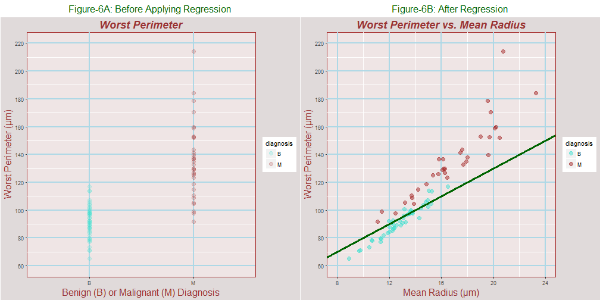
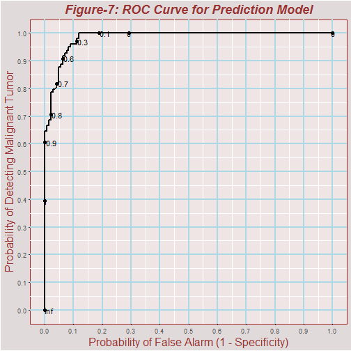
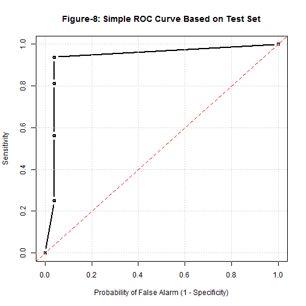

  

##      Prediction and Detection of Malignant Nuclei from Breast Cancer Tumors

#####    February 1, 2017
Prepared by Marcel Merchat

  

##     Overview
We explore ten cell dimension variables and a corresponding set of worst dimensions derived from fine needle aspiration (FNA) samples of breast tumors. The data is taken from the University of Wisconsin dataset that originated with Dr. William Wolberg. The analysis quantifies how the worst dimensions of malignant nuclei are greater than the worst dimensions of healthier benign ones. Finally, we develop an algorithm that predicts whether tumors are malignant or benign from a training data set and evaluate it using a test data set. 

We adjust the algorithm to increase the probability of detecting malignant tumors which raises the rate of false alarms. The relationship between these probabilites are illustrated by the characteristic curve in Figure-7. In statistical detection theory, this plot is called a receiver operating curve (ROC). 

The measurements were taken with a digital camera and a computer software program called Xcyt. A technician isolates individual nuclei and draws the approximate boundary of each nucleus using a computer mouse pointer in an technique known as "snakes." This is repeated for at least 10 cell nuclei for each sample and the software program smooths the pointer data and calculates average nuclear boundaries. A similar process is performed for each of the ten nuclei characteristics, measuring size, shape, and texture. Finally, the mean, standard error and extreme values of these characteristics are computed. 

  

##    Raw Data

There are a total of 569 observation records consisting of 357 benign (B) and 212 malignant (M) cases. The data file is available from the University of Wisconsin server at http://ftp.cs.wisc.edu/math-prog/cpo-dataset/machine-learn/cancer/WDBC/WDBC.dat. Since this source lacked column names, the names were taken from an updated version that could only be manually downloaded at https://www.kaggle.com/uciml/breast-cancer-wisconsin-data. There are 32 columns of data including identification, diagnosis, and three groups of ten variables. The statistical mean values for the ten variables below are reported in Columns 3-12. 

#### Information:

https://archive.ics.uci.edu/ml/machine-learning-databases/breast-cancer-wisconsin/wpbc.names and http://pages.cs.wisc.edu/~olvi/uwmp/cancer.html

Study Paper by William Wolberg, Nick Street, Dennis Heisey, and Olvi L. Mangasarian https://dollar.biz.uiowa.edu/~street/research/hu_path95/hp95.pdf

#### Observations: 

###### a) radius (mean of distances from center to points on the perimeter) 
###### b) texture (standard deviation of gray-scale values)
###### c) perimeter
###### d) area
###### e) smoothness (local variation in radius lengths)
###### f) compactness (perimeter^2 / area - 1.0)
###### g) concavity (severity of concave portions of the contour)
###### h) concave points (number of concave portions of the contour)
###### i) symmetry
###### j) fractal dimension ("coastline approximation" - 1)

The corresponding standard errors for the ten variables are reported in Columns 13-22 and the correspsonding worst values in Columns 23-32. For example, since Field-3 is the mean radius, Field-13 is standard error (se) of the radius and Field-23 is the worst radius. 

  

##   Selection of Training Set

The data was divided into model building and validation sets. The build set was then further divided using a two-fold partition for training and model algorithm tryout testing.

  

##   Exploration

  

#### Correlation with Diagnosis

The top row of the heat map below in Figure-1 indicates the degree of correlation with the diagnosis for variables with correlation coefficients greater than 0.6 (r > 0.6). The dark square at the upper right corner of the map indicates the trivial correlation of the diagnosis with itself as do the other squares along the same diagonal. The squares across the top row indicate the correlation of the other variables with the diagnosis. The next darkest shaded squares in the top row are for the mean perimeter(perimeter_mean), worst radius (radius_worst), and worst perimeter (perimeter_worst).  

#### Correlation between Predictive Variables

If we remove the top horizontal row and the vertical column at the right edge in Figure-1 above, the remainder is a heat map for the correlation between predictive variables. The red area at the lower left indicates high correlation between the mean radius, perimeter, and area. The red area near the midpoint of the bottom edge indicates high correlation between these basic dimension variables and the worst parameters of the same variables. The blue areas above these two groups show a lower correlation between the basic dimensions and the concavity and compactness. 

  

#### Decomposition in Principal Components

The variables are transformed into orthogonal or statistically independent components using a linear algebra function called "prcomp" in an R package. The three biggest independent components separate benign and malignant cases as shown in Figure-2 below with the third component performing the best. There are many other components and only three are illustrated below. 

  

### Different Types of Serial Numbers

There are six different serial numbers lengths from four to nine digits. Since the characteristics of observation records with lengths of 4 and 9 digits seem to vary a little from the other records, group numbers were assigned that indicate the length of the serial number which varies from four to nine digits. Groups 4 and 9 were deleted from this study because Group-49 has a steeper fitted line than Group-8 in Figure-3A below. Group-49 consists of Group-4 and Group-9 combined into a single group.

Based on the what Figure-3A indicates for Groups-4 and Group-9, we study the remaining groups in Figure-3B where Groups 7 and 8 seems to be a representative subgroup for the remaining groups. We build and test our prediction algorithm using the subset of observations that have 7 and 8 digit serial numbers, defining this subset as Group-78 which consists of a subgroup of 81 rows of observation records. Analysis of the other Groups 5 and 6 could be made also as they different a little from Group-78. The algorithm training tryout group consisted of 49 randomly selected records from Group-8 with 21 reserved for final validation testing. 

Since there are 357 benign and 212 malignant cases in the entire dataset. Group-78 consists of 38 benign and 43 malignant cases which is a higher rate of malignant cancers and requires future study. 

<!-- html table generated in R 3.3.2 by xtable 1.8-2 package -->
<!-- Wed Feb 01 11:06:21 2017 -->
<table border=1>
<caption align="top"> Table-1: Serial Number Groups </caption>
<tr> <th> Serial_Number_Length </th> <th> Quantity </th>  </tr>
  <tr> <td align="center"> (digits) </td> <td align="center">   </td> </tr>
  <tr> <td align="center"> 4 </td> <td align="center"> 4 </td> </tr>
  <tr> <td align="center"> 5 </td> <td align="center"> 12 </td> </tr>
  <tr> <td align="center"> 6 </td> <td align="center"> 162 </td> </tr>
  <tr> <td align="center"> 7 </td> <td align="center"> 46 </td> </tr>
  <tr> <td align="center"> 8 </td> <td align="center"> 35 </td> </tr>
  <tr> <td align="center"> 9 </td> <td align="center"> 6 </td> </tr>
   </table>

  

Plot-2 shows the data is more uniform with Group-49 deleted. Notice that Group-8 in brown seems to represent typical members with this change. For the remainder of this study, we focus on Group-8. 

  

### Exploration of Group-78

#### Separating Benign (B) and Malignant (M) Clusters

  

#### Method-1: k-means

A plot of the worse concave points versus mean compactness appears to separate the malignant and benign data points into two loose clusters in Plot-4A below. The center of the benign (B) and malignant (M) clusters was determined using the kmeans function and are indicated by crosses in the figure. To help predict the diagnosis, the assigned cluster group is added to the raw data frame. The fitted lines for the clusters are distinct from one another with the line through the malignant points higher in the plot. This indicates greater worst concave points dimensions for a given degree of compactness for malignant nuclei.

  

#### Method-2: Adjusting Detection Power versus False Alarms (ROC Curve) - Using Improvised Rules

A plot of worst concavity versus mean perimeter in Figure-4B below also divides the data into two groups but this time the nature of the separation does not lend itself to k-means defined clusters because the range of mean perimeters for malignant nuclei also covers part of the range for benign nuclei. But we can devise some improvised formulas that isolate the benign tumors at the lower left corner of the plot as follows.

###### Rule-1: The tumors are all benign if the worst concavity is below 100 and below the imposed divison line.
###### Rule-2: Otherwise assume tumors are malignant. 

Rule-1 corresponds to only accepting nuclei as benign for blue points in the lower left of Plot-4B. Adding our imposed rule to the data forces the formula to skew prediction probabilities in favor of detecting malignant cases. 

  

Rule-2 rule is defined by the dotted brown line in Plot-3B. It helps predict if tumors are benign or malignant but it also provides a way to adjust the automated predictions provided by the carrot package in order to optimize the power of detecting malignant nuclei at the cost of producing more false alarms. There is an inherent tradeoff between detection power and number of false alarms. Our goal is to optimize the overall cost of missed detections and false alarms instead of an overall accuracy figure.

  

  

#### Regression Analysis Help

If the data for benign and malignant cases appear mixed together or cover the same range, we might still be able to separate them using regression. In Plot-6A, the worst perimeter measurements for the two groups overlap; but after regression against the mean radius is applied in Plot-6B, benign and malignant cases separate into distinct groups.  

  

##   Prediction Model

The best prediction models include independent uncorrelated variables but these models usually need to be compared with simpler types that are easier to interpret. An automated way to include only uncorrelated variables in a prediction model is possible with linear algebra and can be implemented with principal components analysis (PCA).  

Two prediction models were contructed. The first method is a random forest method because it usually works well in most cases. The second model was based on pre-processing with principal components analysis followed by random forest model fitting using the uncorrelated principal components. Confusion matrix for these methods are presented at the end of the report in Tables 3 and 4 respectively. 

For the first method with random forest alone, the variables are chosen based on careful study. Variables from both blue and red squares in the heat map at Figure-1 were selected because the degree of correlation is less between these areas. Many correlated variables were were eliminated to simplify the model and reduce the noise level. For example, the radius, perimeter, and area are highly correlated and only one of these is used for any given comparison. The worst perimeter, worst concavity, and worst concave points were selected for the model because they are highly correlated with the diagnosis as can be determined by the top row of the heat map. They were plotted against the mean compactness and mean perimeter as regressor variables to gain further insight.

  

## Performance

  

  

###  Training Test Results with Random Forest Method 

<!-- html table generated in R 3.3.2 by xtable 1.8-2 package -->
<!-- Wed Feb 01 11:06:34 2017 -->
<table border=1>
<caption align="top"> Table-2: Results for Test Set </caption>
<tr> <th> test_predictions </th> <th> Actual_Diagnosis </th> <th> Testing_Accuracy </th>  </tr>
  <tr> <td align="center"> B </td> <td align="center"> B </td> <td align="center"> TRUE </td> </tr>
  <tr> <td align="center"> M </td> <td align="center"> M </td> <td align="center"> TRUE </td> </tr>
  <tr> <td align="center"> M </td> <td align="center"> M </td> <td align="center"> TRUE </td> </tr>
  <tr> <td align="center"> M </td> <td align="center"> M </td> <td align="center"> TRUE </td> </tr>
  <tr> <td align="center"> M </td> <td align="center"> M </td> <td align="center"> TRUE </td> </tr>
  <tr> <td align="center"> M </td> <td align="center"> M </td> <td align="center"> TRUE </td> </tr>
  <tr> <td align="center"> M </td> <td align="center"> M </td> <td align="center"> TRUE </td> </tr>
  <tr> <td align="center"> M </td> <td align="center"> M </td> <td align="center"> TRUE </td> </tr>
  <tr> <td align="center"> B </td> <td align="center"> B </td> <td align="center"> TRUE </td> </tr>
  <tr> <td align="center"> B </td> <td align="center"> B </td> <td align="center"> TRUE </td> </tr>
  <tr> <td align="center"> M </td> <td align="center"> M </td> <td align="center"> TRUE </td> </tr>
  <tr> <td align="center"> B </td> <td align="center"> B </td> <td align="center"> TRUE </td> </tr>
  <tr> <td align="center"> B </td> <td align="center"> B </td> <td align="center"> TRUE </td> </tr>
  <tr> <td align="center"> M </td> <td align="center"> M </td> <td align="center"> TRUE </td> </tr>
  <tr> <td align="center"> B </td> <td align="center"> B </td> <td align="center"> TRUE </td> </tr>
  <tr> <td align="center"> M </td> <td align="center"> M </td> <td align="center"> TRUE </td> </tr>
  <tr> <td align="center"> B </td> <td align="center"> M </td> <td align="center"> FALSE </td> </tr>
  <tr> <td align="center"> B </td> <td align="center"> B </td> <td align="center"> TRUE </td> </tr>
  <tr> <td align="center"> B </td> <td align="center"> B </td> <td align="center"> TRUE </td> </tr>
  <tr> <td align="center"> B </td> <td align="center"> B </td> <td align="center"> TRUE </td> </tr>
  <tr> <td align="center"> B </td> <td align="center"> B </td> <td align="center"> TRUE </td> </tr>
  <tr> <td align="center"> B </td> <td align="center"> B </td> <td align="center"> TRUE </td> </tr>
  <tr> <td align="center"> M </td> <td align="center"> B </td> <td align="center"> FALSE </td> </tr>
  <tr> <td align="center"> B </td> <td align="center"> B </td> <td align="center"> TRUE </td> </tr>
  <tr> <td align="center"> M </td> <td align="center"> M </td> <td align="center"> TRUE </td> </tr>
  <tr> <td align="center"> M </td> <td align="center"> M </td> <td align="center"> TRUE </td> </tr>
  <tr> <td align="center"> B </td> <td align="center"> B </td> <td align="center"> TRUE </td> </tr>
  <tr> <td align="center"> B </td> <td align="center"> B </td> <td align="center"> TRUE </td> </tr>
  <tr> <td align="center"> M </td> <td align="center"> M </td> <td align="center"> TRUE </td> </tr>
  <tr> <td align="center"> B </td> <td align="center"> B </td> <td align="center"> TRUE </td> </tr>
  <tr> <td align="center"> B </td> <td align="center"> B </td> <td align="center"> TRUE </td> </tr>
  <tr> <td align="center"> B </td> <td align="center"> B </td> <td align="center"> TRUE </td> </tr>
  <tr> <td align="center"> M </td> <td align="center"> M </td> <td align="center"> TRUE </td> </tr>
  <tr> <td align="center"> B </td> <td align="center"> B </td> <td align="center"> TRUE </td> </tr>
  <tr> <td align="center"> B </td> <td align="center"> B </td> <td align="center"> TRUE </td> </tr>
  <tr> <td align="center"> B </td> <td align="center"> B </td> <td align="center"> TRUE </td> </tr>
  <tr> <td align="center"> B </td> <td align="center"> B </td> <td align="center"> TRUE </td> </tr>
  <tr> <td align="center"> M </td> <td align="center"> M </td> <td align="center"> TRUE </td> </tr>
  <tr> <td align="center"> B </td> <td align="center"> B </td> <td align="center"> TRUE </td> </tr>
  <tr> <td align="center"> B </td> <td align="center"> B </td> <td align="center"> TRUE </td> </tr>
  <tr> <td align="center"> B </td> <td align="center"> B </td> <td align="center"> TRUE </td> </tr>
  <tr> <td align="center"> M </td> <td align="center"> M </td> <td align="center"> TRUE </td> </tr>
   </table>

  

### Detection Power versus False Alarms (ROC Curve) for Random Forest Model without Principal Components
This is an inherent tradeoff between detection power and the number of false alarms. This curve was generated using R Tools carrot, pROC, plotROC using the train function output for the prediction model. The "pred" list item of the output contains the data frame for the curve. 

  

#####    Sensitivity: The probability of a positive test result if the disease is present
#####    Specificity: The probability of negative test if the disease is not present
#####    Probability of False Alarm  =  1 - Specificity

  

   

Rather than overall accuracy, the probabilities and costs of detection and false alarms are important in the case of radar systems and in other problems such as cancer detection. In the case of a defensive radar system, selectivity determines the probability shooting down your own plane and injuring a friendly pilot. It might be less than optimal to focus on an overall accuracy that mixes sensitivity and selectivity into a single parameter when the costs of failing to detect a condition (sensitivity) and false alerts (the complement of sensitivity) are separately important with their own costs. 

To help control our model, the cluster identification for k-means for worst concave points as shown in Plot-4A and worst concavity according to the dotted lines in Plot-4B were added to the data frame. Adding extra parameters should help adjust the ROC curve by raising the detection power for malignant tumors in order to optimize the power of detecting existing malignant tumors at the cost of producing more false alarms.

  

### Simplified ROC Curve for Worst Concave Points Test Set Results 
This characteristic curve is based only based on the worst concave points of the test. 

   

### Confusion Matrix for Random Forest Prediction

The table below describes the results for the test set.

<!-- html table generated in R 3.3.2 by xtable 1.8-2 package -->
<!-- Wed Feb 01 11:06:35 2017 -->
<table border=1>
<caption align="top"> Table-3: Prediction Accuracy for Basic Random Forest Model </caption>
<tr> <th> Parameter </th> <th> Test </th> <th> Diagnosis </th> <th> Counts </th> <th> Correct_Detections </th> <th> Accuracy </th>  </tr>
  <tr> <td align="center"> Detection Power </td> <td align="center"> Sensitivity </td> <td align="center"> Malignant </td> <td align="center">  17 </td> <td align="center">  16 </td> <td align="center"> 0.94 </td> </tr>
  <tr> <td align="center"> False Alarm </td> <td align="center"> 1 - Specificity </td> <td align="center"> Benign </td> <td align="center">  25 </td> <td align="center">  24 </td> <td align="center"> 0.96 </td> </tr>
   </table>

  

### Confusion Matrix for Principal Components Analysis

The table below describes the results for the test set.

<!-- html table generated in R 3.3.2 by xtable 1.8-2 package -->
<!-- Wed Feb 01 11:06:35 2017 -->
<table border=1>
<caption align="top"> Table-4: PCA Prediction Accuracy </caption>
<tr> <th> Parameter </th> <th> Test </th> <th> Diagnosis </th> <th> Counts </th> <th> Correct_Detections </th> <th> Accuracy </th>  </tr>
  <tr> <td align="center"> Detection Power </td> <td align="center"> Sensitivity </td> <td align="center"> Malignant </td> <td align="center">  17 </td> <td align="center">  16 </td> <td align="center"> 0.94 </td> </tr>
  <tr> <td align="center"> False Alarm </td> <td align="center"> 1 - Specificity </td> <td align="center"> Benign </td> <td align="center">  25 </td> <td align="center">  24 </td> <td align="center"> 0.96 </td> </tr>
   </table>

   

Code for this reproducible report is available at https://github.com/marcelMerchat/breastCancer_WI.

  

#### THE END

